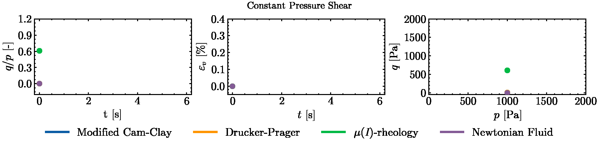
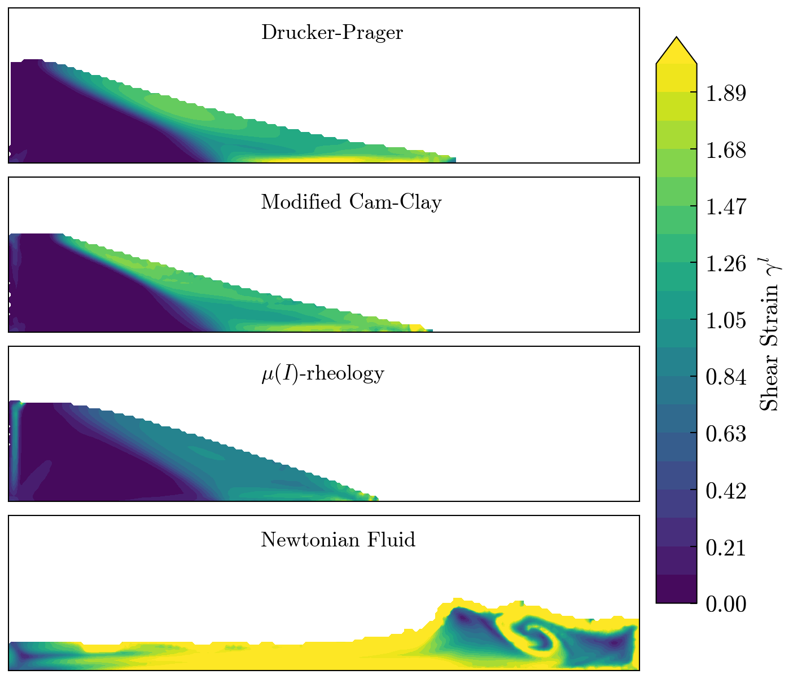

<br /><br />

<div style="position: relative; height: 160px; margin-bottom: 20px;">
  <p align="center" style="position: absolute; top: 0; left: 0; width: 100%;">
    
  </p>
</div>
<h1 align="center"><b>HydraxMPM</b></h1>
<p align="center">
  <b>A JAX-powered Material Point Method & Single Integration Point simulation environment for granular materials</b>
</p>
<p align="center" style="font-style: normal; letter-spacing: 1px; font-size: 0.9em; opacity: 0.9;">
  Develop · Diagnose · Simulate
</p>
<p align="center">
  📖 <a href="LINK_TO_YOUR_DOCUMENTATION_SITE"><strong>Documentation (coming Soon)</strong></a> | ⚙️ <a href="#installation">Installation</a> | 🤝 <a href="LINK_TO_CONTRIBUTING.MD">Contributing (coming Soon)</a>
  <!-- Add badges here if you have them: e.g., build status, license -->
</p>


HydraxMPM integrates the **Material Point Method (MPM)** solver for large-scale granular dynamics simulations and **Single Integration Point (SIP)** testing <!--for detailed constitutive **model creation and diagnosis**-->, within one environment. Built on JAX, it leverages automatic differentiation and hardware acceleration (CPU/GPU/TPU) for research and development of numerical models capturing solid-like and fluid-like behavior of granular materials.


<p align="center"> 
  <picture>
    <source media="(prefers-color-scheme: dark)" srcset="docs/_static/sip_animation_light.gif">
    <source media="(prefers-color-scheme: light)" srcset="docs/_static/sip_animation_dark.gif">
    
  </picture>
</p>


<table style="margin: 0px auto;" align="center" >
  <tr>
    <td align="center" valign="top"  padding="0 15px 0 0">
      <source media="(prefers-color-scheme: dark)" srcset="docs/_static/mpm_models_ss_light.png">
      <source media="(prefers-color-scheme: light)" srcset="docs/_static/mpm_models_ss_dark.png">
      
    </td>
    <td align="center" valign="top"  padding="0 15px 0 0">
      <source media="(prefers-color-scheme: dark)" srcset="docs/_static/mpm_models_ke_light.png">
      <source media="(prefers-color-scheme: light)" srcset="docs/_static/mpm_models_ke_dark.png">
      
    </td>
  </tr>
</table>

    

    
    
## Capabilities

*   🔬 **Diagnose Constitutive Models:** Perform controlled SIP tests (triaxial, shear, and compression) for advanced constitutive model analysis.
*   ⛰️ **Simulate Large-Scale Processes:** Model complex, large-deformation granular processes (e.g., landslides) using MPM.
*   ⚖️ **Validate Across Scales:** Compare solid-l  ike and fluid-like model behavior at both element (SIP) and system (MPM) levels.
*   ∇ **Gradient-Aware:** Utilize automatic differentiation for sensitivity analysis, inverse problems, and optimization.

## Key Features

*   **Unified MPM & SIP:** Shared API facilitates rapid prototyping and validation.
*   **High Performance:** JAX backend with JIT compilation.
*   **Differentiable:** Enables advanced gradient-based studies.
*   **Modular:** Designed for extensibility in research settings.
*   **Solvers & Schemes:** Explicit MPM (USL) with FLIP/PIC, APIC, AFLIP transfer; Linear, Quadratic, Cubic B-spline basis functions.
*   **Available Models:** Drucker-Prager, Modified Cam-Clay, Newtonian Fluid, Incompressible $\mu (I)$ rheology.
*   **SIP Tests:** Triaxial (Drained/Undrained), Constant Pressure/Volume Shear, Isotropic Compression.
*   **Contact & Boundaries:** Rigid body contact (penalty-based), slip/no-slip conditions.
*   **Time Stepping & Stability:** Fixed and adaptive time stepping with Courant–Friedrichs–Lewy (CFL) condition.


## Installation

1.  **Install uv:** Follow instructions [here](https://docs.astral.sh/uv/getting-started/installation/).
2.  **Clone & Install Dependencies:**
    ```bash
    git clone https://github.com/GrainLearning/HydraxMPM.git && cd HydraxMPM
    uv sync
    ```
3.  **Run Example:**
    ```bash
    uv run ./examples/dambreak/dambreak.py
    ```
    *(Output in `./examples/dambreak/output`)*


## 👥 Contributors:

* Retief Lubbe (Soil Micro Mechanics group / University of Twente)
* Hongyang Cheng (Soil Micro Mechanics group / University of Twente)

## 🙏 Acknowledgements
This research is part of the project TUSAIL [Training in Upscaling Particle Systems: Advancing Industry across Length-scales](https://tusail.eu)  and has received funding from the European Horizon2020 Framework Programme for research, technological development and demonstration under grant agreement ID 955661.

> [!WARNING]
> This is a research software under active development (pre-alpha). APIs and functionality are subject to change without notice.


<!--
## 🧠 Key Benefits

* **Unify local and global views:** Test, compare and validate constitutive models at a SIP-level, and directly apply them to large-scale MPM simulations – all within the same framework.
* **Cutting-Edge performance** Built on JAX, leveraging Just-In-Time (JIT) for high-performance array-based operations on the CPU, GPU, and TPU.
* **Solve inverse problems with ease:** All internals are automatically differentiable, enabling model diagnosis and gradient-based optimization (e.g., reducing the need to solve the tangential stiffness tensor).
* **Modular & Extendable:** The modular structure, coupled with batched and parallelized continuum mechanics operations, will enable modification and extension of existing components, while also enabling rapid prototyping. -->
