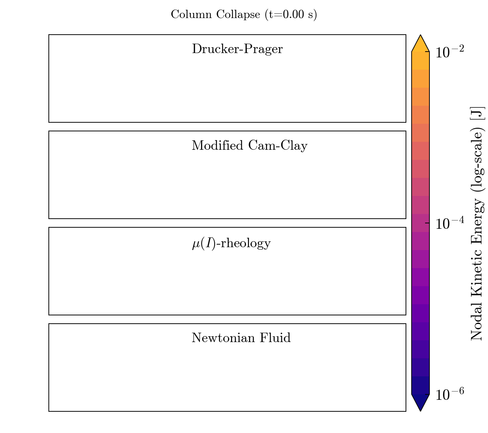
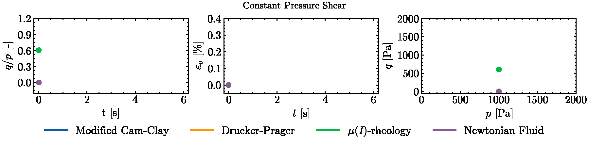

<br /><br />

<div style="position: relative; height: 160px; margin-bottom: 20px;">
  <p align="center" style="position: absolute; top: 0; left: 0; width: 100%;">
    
  </p>
</div>

<h1 align="center"><b>HydraxMPM</b></h1>
<p align="center">
  <b>A JAX-powered Material Point Method & Single Integration Point simulation environment for granular materials</b>
</p>

HydraxMPM packages the **Material Point Method (MPM)** solver for large-scale granular dynamics simulations and **Single Integration Point (SIP)** testing within one environment. 

The software is built on the JAX-ecosystem. It leverages automatic differentiation and hardware acceleration (CPU/GPU/TPU) for research and development of numerical models capturing solid-like and fluid-like behavior of granular materials.

## Installation

1. **Install uv:** Follow instructions [here](https://docs.astral.sh/uv/getting-started/installation/).

2. **Clone & Install Dependencies:**
   
   ```bash
   git clone https://github.com/GrainLearning/HydraxMPM.git && cd HydraxMPM
   
   # for CPU
   uv sync --extra cpu
   
   # for GPU
   uv sync --extra 
   ```

3. **Run Example:**
   
   ```bash
   uv run ./projects/collapse/collapse.py
   ```

## Key Features

* **Unified MPM & SIP:** Shared API facilitates rapid prototyping and validation.
* **High Performance:** JAX backend with JIT compilation.
* **Differentiable:** Enables advanced gradient-based studies.
* **Modular:** Designed for extensibility in research settings.
* **Solvers & Schemes:** Explicit MPM (USL) with FLIP/PIC, APIC, AFLIP transfer; Linear, Quadratic, Cubic B-spline basis functions.
* **Available Models:** Drucker-Prager, Modified Cam-Clay, Newtonian Fluid, Incompressible $\mu (I)$ rheology.
* **SIP Tests:** Triaxial (Drained/Undrained), Constant Pressure/Volume Shear, Isotropic Compression.
* **Contact & Boundaries:** Rigid body contact (penalty-based), slip/no-slip conditions, level-set
* **Time Stepping & Stability:** Fixed and adaptive time stepping with Courant–Friedrichs–Lewy (CFL) condition.

<h3 align="center"><b>Simulate</b></h3>
<p align="center"> 
  <picture>
    
  </picture>
</p>

<h3 align="center"><b>Infer</b></h3>
<p align="center"> 
  <picture>
    
  </picture>
</p>

<h3 align="center"><b>Diagnose</b></h3>
<p align="center"> 
  <picture>
    
  </picture>
</p>

## 👥 Contributors:

* Retief Lubbe (Soil Micro Mechanics group / University of Twente)
* Hongyang Cheng (Soil Micro Mechanics group / University of Twente)

## 🙏 Acknowledgements

This research is part of the project TUSAIL [Training in Upscaling Particle Systems: Advancing Industry across Length-scales](https://tusail.eu)  and has received funding from the European Horizon2020 Framework Programme for research, technological development and demonstration under grant agreement ID 955661.