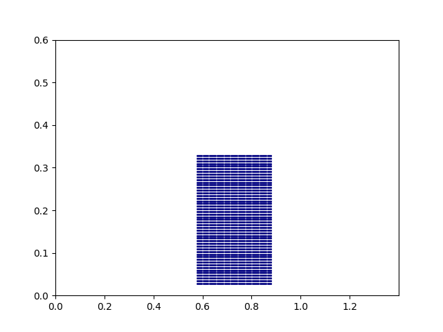

# Tutorial 1. Granular column collapse


Required knowledge

- Installed HydraxMPM
- Read through JAX sharp bits


- Recommended to creat a python script and follow along, alternatively code can be found at X

- Both jnp and np can be used

- Import modules

```python {hl_lines="4"}

--8<-- "1_granular_column/granular_column.py:2:7"

```

- All modules in HydraxMPm is loaded from a base base directory.


<!--  -->


```python 

--8<-- "1_granular_column/granular_column.py:8:25"

```

- Positions has shape `(number of material points, dimension)` 
- Array of positions, or stress tensors are typically denoted as stacks


```python 

--8<-- "1_granular_column/granular_column.py:27:37"

```



- Added spacing is due to thickness of boundaries


```python 

--8<-- "1_granular_column/granular_column.py:38:52"

```

- Config can always be changed (recall jax is a stateful framework) 
- Build in function replace
- Domain bounds, particles per cell, cell size  are passed down,
- also important that num points, meaning number of material points passed down
- Some objects with Hydrax use same quantities. as the memory needs to be prelocated.
- Defualt GPU id says which gpu to use (type nvidia-smi for looking)
- dt is the constant time step
- file __file__ basically gives the location of the file, which is important for saving relative output
- project gives the project name, which is also used during output
- config see api on more detail
- Cubic shape functions are used, currently HydraxMPM supports BSMPM and linear shapre functions

```python 

--8<-- "1_granular_column/granular_column.py:53:53"

```

- Print summary gives a basic overview (show output)

```
~~~~~~~~~~~~~~~~~~~~~~~~~~~~~~~~~~~~~~~~~~~~~~~~~~~~~~~~~~~~~~~~~~~~~~~~~~~
project: tutorial1
dim: 2
num_points: 625
num_cells: 1400
num_interactions: 10000
domain origin: (0, 0)
domain end: (1.399999976158142, 0.6000000238418579)
dt: 3.0000000000000004e-05
total time: 12.000000000000002
~~~~~~~~~~~~~~~~~~~~~~~~~~~~~~~~~~~~~~~~~~~~~~~~~~~~~~~~~~~~~~~~~~~~~~~~~~~
```

```python 

--8<-- "1_granular_column/granular_column.py:55:57"

```